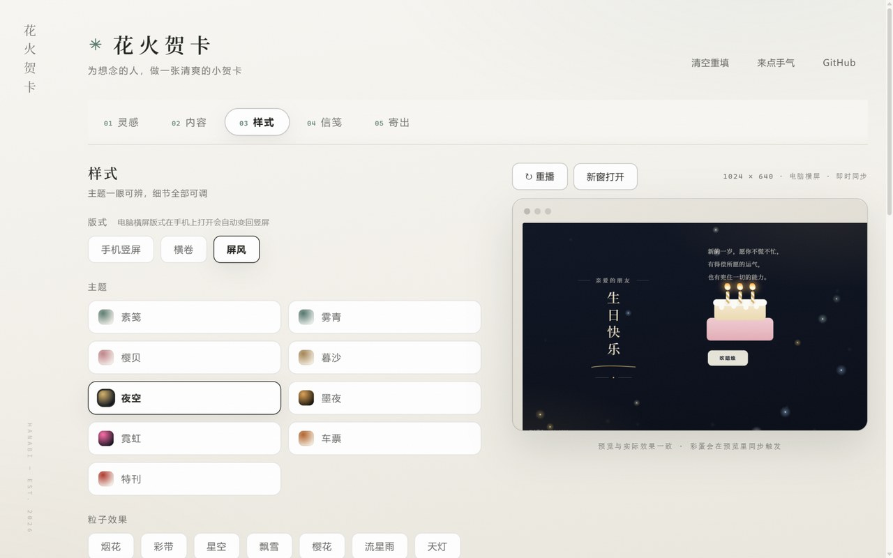

<div align="center">

# ✦ 花火贺卡 Hanabi

**为想念的人，做一张清爽的小贺卡。**

[在线体验](https://hanabi-sigma.vercel.app/) · [问题反馈](https://github.com/FANG050829/Hanabi_card/issues)

| 制作 | 播放 |
| --- | --- |
|  |  |

纯前端 · 无后端 · 零依赖 —— 整张贺卡的配置被编码进链接本身，
**链接即贺卡**：不存储任何数据，谁打开链接，谁的浏览器里就地播放。

</div>

---

选一个灵感样式，写上名字与祝福，寄出一条链接——对方点开，就是一场小演出：
信封开启，标题逐字亮起，祝福缓缓浮现，然后是 TA 的一张照片、一段声音、
一笔一划写出来的签名，和一句只属于这张卡的签语。
手机上是竖屏小演出，电脑上是铺满整屏的横屏版式——同一张卡，两个舞台。

## 收卡人看到什么

- **开场**：信封（通用场景）或礼盒（生日·圣诞）浮在纸上，也可换成
  刮刮卡（亲手刮开祝福）或拂晓雾（指尖拂开晨雾）；设了滑动门槛的卡，
  先滑到最右才见信封——
  开启的那一次点按同时解锁声音，**有语音先闻其声，结束后音乐才起**
- **内容**：标题逐字弹出（可选简笔涂鸦先一笔一画画出）、题下细线描画、
  祝福语打字机浮现；祝福里单独一行 `---` 即分页，读完轻触翻页
- **心意**：拍立得照片（最多 6 张，轻触换下一张、长按放大）、手写签名
  （笔迹一笔一划重现后盖青瓷印）、蛋糕蜡烛（生日专属：**对着麦克风吹一口气**
  就能吹灭，点按照样管用，吹灭冒烟、画面变亮）
- **互动**：签筒求签或拆盲盒——轻摇两下，签滑出 / 盒盖弹开，
  落定即揭晓这张卡的签语；任意时刻轻触夜空，赠出一颗心
- **点缀**：十七种粒子效果铺满全程——烟花（纸白底上是水彩晕染质感）、彩带、
  星空、飘雪、樱花、流星雨、天灯、萤火虫、极光、泡泡，以及为宽屏而生的
  文字烟花（把标题炸成星火再聚成字）、星轨、深海、蒲公英、雨窗、数字雨，
  还有一架载着祝福的纸飞机拖着虚线航迹缓缓掠过；
  手指划过卡面，拖出一串主题色微光
- **大屏**：电脑横屏版式「横卷」「屏风」把左右两栏铺满整屏——
  竖排的题字与印落在左，正文与互动在右；手机上打开自动回退竖屏，无需两份链接
- **收尾**：帖号签语浮现（每条链接确定性对应一句签语，同链接永远同签）、
  「回 TA 一张」把样式镜像带去编辑器，来往就成了一条线
- **保密与准时**：设了密语的卡先出解锁框，答对才播；定了时间的卡到点前
  只见倒计时门，到点自动揭开并放一朵烟花

## 你能定制什么

- **内容**：收件人、标题、祝福语（500 字，可分页）、署名、
  **最多 6 张照片**（超链接限额自动逐档压缩，「照片取色」一键把首图的主色
  套给强调色与背景色）、**现场录制的语音**（≤60 秒）、手写板签名；
  文案没灵感？「帮你起两句」离线组合，或六首「藏头诗」一键填入
- **版式**：手机竖屏（经典单列）/ 横卷（左封面右正文）/ 屏风（竖排题字），
  主题、粒子、字体全部照常搭配
- **样式**：九套主题（纸白四套：素笺 / 雾青 / 樱贝 / 暮沙；
  夜帖两套：夜空 / 墨夜；再加霓虹灯牌、车票、报纸特刊三套带专属排面的主题）
  × 十七种粒子 × 三种卡面字体 × 粒子密度，强调色与背景色可自定；
  「标题流光」让一道金光周期性扫过标题
- **仪式**：开场方式（信封 / 刮刮卡 / 拂晓雾）× 收尾互动（求签筒 / 拆盲盒）
  × 滑动解锁门槛，可两两叠加（先定时、再滑动、后密语）
- **寄出保护**：填了密语，链接里的配置整体 AES-GCM 加密（密语只留在
  编辑器内存，绝不写进草稿与链接明文），收卡人答对才播；
  选了开启时间，到点前对方只看得到倒计时门
- **彩蛋**：屏幕震动 / 弹窗雨 / 跑路红包 / 祝福弹幕 / 电子木鱼（功德 +1）/
  锦鲤游屏 / 金粉喷雾 / 屏幕碎裂 / 表情包雨，全部有界可关
- **细节开关**：触点粒子拖尾、标题流光、简笔涂鸦、随音乐律动（频谱条）、
  摇一摇彩带（会请求传感器权限，默认关）——逐项可开可关
- **信笺**：上传你自己的 HTML 当贺卡，`{{收件人}}` `{{标题}}` `{{祝福语}}`
  `{{署名}}` 占位符寄出时自动替换，收卡人在沙盒 iframe 里看到的就是你写的页面

## 七种寄出方式

| 通道 | 适合 | 备注 |
| --- | --- | --- |
| 贺卡链接 | 微信 / QQ 点开即播 | 配置编码进链接，超过承载上限的部分自动降级并提示 |
| 贺卡文件 | 独立 .html，离线双击即播 | 完整携带大音乐 / 大信笺，不依赖网络 |
| 祝福邮件 | 排好版的网页邮件 | 复制后粘贴进 Gmail / QQ 邮箱正文即成 |
| 邮件应用 | 填邮箱唤起 mailto | 纯文本祝福 + 贺卡链接 |
| 短信 | 唤起系统短信 | 链接较长时慎用 |
| 实体贺卡 | 打印对折卡面 | 封面 + 内页两张排面；链接够短时封面自带二维码，扫了直达贺卡 |
| 分享长图 | 朋友圈 / 聊天图片 | 卡面祝福 + 首张照片 + 二维码合成一张竖图下载 |

另有「下载发送提醒 (.ics)」：明天这个时间，提醒你把链接寄出去。

## 快速开始

**在线使用（推荐）**：打开 [hanabi-sigma.vercel.app](https://hanabi-sigma.vercel.app/) 即可制作。

**本地运行**：克隆仓库后双击 `index.html`。
注意 `file://` 下生成的链接只有你自己能打开，分享请先部署。

**部署到 Vercel（零配置）**：仓库推到 GitHub 后，在
[vercel.com/new](https://vercel.com/new) 导入——框架选 Other，
构建指令 / 输出目录 / 安装命令全部留空，环境变量不加，Deploy 即可。
也可以 CLI：`npm i -g vercel && vercel --prod`。

## 核心机制

配置共 28 个字段：
`{ to, title, message, from, occasion, layout, theme, effect, font, opening, gate, oracle, density, accent, bg, shine, doodle, spectrum, trail, shake, prank, music, voice, photo, photos, sign, custom, unlockAt }`。
其中 `layout` 是版式（portrait / scroll / folding），`opening` / `gate` / `oracle`
是开场、门槛与收尾互动，`shake` 到 `trail` 是细节开关，布尔值只有 `'on' / 'off'`；
音乐 / 语音为 `data:audio`，照片为压缩后的 `data:image`（`photos` 是最多
6 张的数组，`photo` 保留为首张以兼容旧链接），签名为量化的手写笔迹，
`unlockAt` 是开启时刻（epoch 毫秒）——全部由编辑器在本地生成。编辑器把配置
`JSON → UTF-8 → base64url` 后拼到 `card.html#<code>`，播放器解析 `location.hash`
还原配置，坏链接一律回落到默认演示。设了密语时这一段换成
`k1.<salt>.<iv>.<密文>`（AES-GCM-256，密钥由密语经 PBKDF2 派生），
没有密语谁都打不开。

任何一项媒体超过链接承载上限时，生成链接会自动去掉该项并提示改走「贺卡文件」；
导出的贺卡文件内嵌全部样式与媒体，离线完整可播。
旧链接（没有新字段）由白名单校验自动回落默认值，永远可播。

全程无网络请求、无 Cookie、无后端——**隐私天然安全**。
帖号（NO.xxxx）与签语由链接字符串确定性推导，同一链接永远同号同签。

## 项目结构

```
Hanabi/
├── index.html      # 编辑器：灵感样式、内容、样式、信笺、寄出
├── card.html       # 播放器：从 URL 的 #hash 解析配置并播放
├── assets/         # README 配图
├── css/style.css   # 主题变量 +「纸白」视觉（留白 / 细线 / 纸纹）+ 电脑横屏版式
└── js/
    ├── config.js   # 默认值 / 版式·开场·门槛·收尾互动注册表 / 场景预设 / 藏头诗 / 签语库 / 校验 / base64url / 密语加解密
    ├── effects.js  # Canvas 粒子引擎（精灵辉光 + 触点拖尾）+ 十七种效果注册表
    ├── themes.js   # 主题注册表（主题 = 一组 CSS 变量 + 粒子配色，共九套）
    ├── qr.js       # 二维码库（qrcode-generator，MIT）——打印封面与分享长图用
    ├── editor.js   # 编辑器逻辑（多照片压缩取色 / 录音 / 手写板 / 版式预览壳切换 / 导出）
    └── player.js   # 播放编排（门槛/密语/倒计时 → 开场四式 → 内容分页 → 吹蜡烛 → 求签/盲盒 → 签名 → 签语 → 彩蛋）
```

## 参与贡献

**新增一种粒子效果**——在 `js/effects.js` 末尾注册即可，编辑器自动出现选项：

```js
/* 示例——萤火虫 */
registerEffect('fireflies', {
  label: '萤火虫',          // 编辑器里显示的中文名
  desc: '仲夏夜之光',        // 一句话描述（悬停提示）
  init: function (ctx, w, h, opts) {
    var colors = opts.palette;              // 当前主题的粒子配色
    var bugs = [];
    for (var i = 0; i < 40; i++) {
      bugs.push({ x: Math.random() * w, y: Math.random() * h, ph: Math.random() * 6.28 });
    }
    return {
      tick: function (c, dt, time) {        // dt：秒；time：自启动起的秒数
        c.globalCompositeOperation = 'lighter';
        for (var i = 0; i < bugs.length; i++) {
          var b = bugs[i];
          b.x += Math.sin(time * 0.7 + b.ph) * 22 * dt;
          b.y += Math.cos(time * 0.5 + b.ph) * 16 * dt;
          var glow = 0.5 + 0.5 * Math.sin(time * 2 + b.ph * 3);
          c.globalAlpha = glow;
          c.fillStyle = colors[i % colors.length];
          c.shadowColor = c.fillStyle; c.shadowBlur = 12;
          c.beginPath(); c.arc(b.x, b.y, 2, 0, 6.283); c.fill();
        }
        c.globalAlpha = 1; c.shadowBlur = 0;
        c.globalCompositeOperation = 'source-over';
      }
    };
  }
});
```

再把效果名加进 `js/config.js` 的兜底白名单：

```js
var FALLBACK_EFFECTS = ['fireworks', 'confetti', 'starfield', 'snow', 'petals', 'meteor', 'lantern', 'fireflies', 'aurora', 'bubbles', 'textfireworks', 'startrail', 'ocean', 'dandelion', 'rainglass', 'matrix', 'paperplane'];
```

完成。约定与建议：

- 画布已按 devicePixelRatio 缩放，坐标一律按 CSS 像素写；
- 动画只用 Canvas / `transform` / `opacity`，不触发布局属性；
- 粒子数量按屏幕面积伸缩（参考现有效果的 `w * h / N` 写法），手机端上限约 200；
- 辉光优先用预渲染精灵（见 `glowSprite`），比逐帧 `shadowBlur` 便宜一个量级；
- `opts.reduced === true` 时引擎只渲染一帧静态画面（尊重系统动效偏好）；
- 想用卡面标题？`opts.text` 里拿着它（参考「文字烟花」的写法）；
- 提 PR 前请用手机宽度（≤ 430px）和电脑宽屏各自测一遍流畅度。

**新增主题**：在 `js/themes.js` 的 `DEFS` 里加一组 CSS 变量与 `palette`
（浅色主题标 `light: true`，深色标 `false`，粒子引擎自动切换绘制方式；
需要专属排面就在 `css/style.css` 里按 `[data-theme="名字"]` 追加）。
**新增版式**：`js/config.js` 的 `LAYOUTS` 注册一项，`card.html` 的
`stage-col` 结构照着「横卷 / 屏风」在宽屏媒体查询里重排。
**新增灵感样式 / 场景 / 藏头诗 / 签语 / 灵感文案**：分别在
`TEMPLATES` / `OCCASIONS` / `POEMS` / `FORTUNES` / `BLESS_BANK` 里加条目。

## License

[MIT](./LICENSE) © 2026 FANG050829
